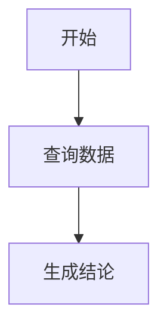

# BiCLI 聊天富内容展示层设计

日期：2026-04-28

范围：

- `dataeye-frontend/src/app/pages/BiCLIWorkbench/Chat`
- `dataeye-frontend/src/app/pages/BiCLIWorkbench/hooks/useChatStream.ts`
- `bicli/packages/mcp-server/src/chat/message-blocks.ts`
- `bicli/packages/mcp-server/src/chat/stream.ts`

相关文档：

- `docs/2026-04-28-rich-message-rendering-design.md`
- `docs/superpowers/plans/2026-04-28-rich-message-rendering.md`

## 1. 背景

当前 BiCLI 聊天展示已经支持：

- assistant 文本通过 `ReactMarkdown + remark-gfm + rehype-highlight` 渲染。
- 流式中先用纯文本展示，流式结束后再完整 Markdown 渲染。
- 后端可通过 `message_block` SSE 发送结构化块，前端已支持 `table`。
- 旧图表仍通过 `chart_data` 和 `ChartWidget` 渲染。

这解决了“列表类数据不要让模型排版”的问题，但展示层还不够完整：

- 历史消息里出现 ```` ```gradle ```` 这类未注册语言时，可能抛 `Unknown language` 并导致会话加载失败。
- 步骤图、流程图、时序图、ER 图、甘特图等外部 AI 产品常见图形语法还没有专门渲染。
- Markdown 文本渲染、代码高亮、图形语法、业务结构化 block 都混在 `MessageItem.tsx`。
- 不常用语言或非法图形语法缺少局部兜底，单个内容块可能影响整条消息。

本设计目标是在展示层面尽可能对齐外部 AI 产品常见能力：常用内容原生渲染，不常用内容稳定兜底。

## 2. 设计原则

### 2.1 主流内容正式支持

常见 Markdown、代码语言、Mermaid 图形语法和 DataEye 业务图表应作为一等能力支持，不能靠吞掉错误解决。

### 2.2 不常用内容可读兜底

未支持的语言、未知图形语法、未知 `message_block.type` 不应导致会话加载失败。兜底展示必须保留原始内容，并提示“暂未增强渲染”。

### 2.3 开放文本和业务 UI 分层

- Markdown 层：承载模型解释、代码片段、通用图形语法。
- Message Block 层：承载工具结果、表格、指标卡、业务图表、步骤列表等结构化数据。

模型可以输出 Mermaid 代码块表达解释性图形，但不能用 Markdown 表格替代工具返回的业务明细。

### 2.4 局部失败不影响整条消息

代码块高亮失败、Mermaid 渲染失败、单个 block 渲染失败，都只能影响当前块，不能影响整个 assistant 消息和历史会话加载。

### 2.5 安全优先

不允许任意 HTML 或脚本执行。Mermaid 使用严格安全配置，结构化 block 只允许白名单 `type` 和白名单字段。

## 3. 外部最佳实践对齐

主流 AI 聊天产品和文档产品一般采用以下能力组合：

- GFM Markdown：表格、任务列表、引用、链接、代码块。
- 常用语言高亮：覆盖主流开发语言、配置语言、Shell、SQL、日志。
- Mermaid 图：用文本协议生成流程图、时序图、状态图、ER 图、甘特图等。
- 专用 artifact / block：对表格、图表、文件、表单、卡片等使用结构化渲染。
- 错误兜底：未知语言显示源码，图渲染失败显示源码和错误，未知 block 显示占位提示。

BiCLI 应采用相同分层：

| 层级 | 适合内容 | 渲染方式 | 兜底 |
| --- | --- | --- | --- |
| Markdown 基础层 | 普通回复、列表、表格、引用、链接 | `ReactMarkdown + remark-gfm` | 原文文本 |
| 代码高亮层 | 代码、SQL、配置、日志 | `rehype-highlight` + 语言注册表 | 普通代码块 |
| 图形语法层 | 流程图、步骤图、时序图、ER 图 | Mermaid 代码块组件 | 源码 + 错误提示 |
| 结构化 block 层 | 工具结果、业务表格、业务图表、指标卡 | `message_block.type` 组件注册表 | UnknownBlock |

## 4. 能力矩阵

### 4.1 Markdown 基础能力

P0 必须支持：

- 标题、段落、加粗、斜体、删除线。
- 有序/无序列表。
- 任务列表。
- 引用。
- 行内代码和代码块。
- GFM 表格。
- 链接。

链接策略：

- 外链使用 `target="_blank"` 和 `rel="noopener noreferrer"`。
- 非 http/https/mailto 协议默认禁止跳转。

### 4.2 代码语言支持

P0 建议正式注册：

- Web：`javascript`、`js`、`typescript`、`ts`、`tsx`、`jsx`、`html`、`css`、`scss`、`less`。
- 数据：`json`、`yaml`、`yml`、`xml`、`csv`。
- Shell：`bash`、`shell`、`sh`、`zsh`、`powershell`。
- 后端：`java`、`kotlin`、`kts`、`gradle.kts`、`groovy`、`gradle`、`python`、`go`、`rust`、`php`、`ruby`、`c`、`cpp`、`csharp`。
- 数据库：`sql`、`mysql`、`postgresql`。
- 配置/运维：`dockerfile`、`properties`、`ini`、`toml`、`nginx`、`log`。
- 文档：`markdown`、`md`、`text`、`plaintext`。

别名策略：

- `gradle` 映射到 `groovy`，表示 Gradle Groovy DSL。
- `gradle.kts` 映射到 `kotlin`。
- `shell`、`sh`、`zsh` 映射到 Shell 类语言。
- `yml` 映射到 `yaml`。
- `md` 映射到 `markdown`。
- `mysql`、`postgresql` 可先映射到 `sql`。

兜底策略：

- 未注册语言显示为普通代码块。
- 代码块 header 保留语言标识，例如“未增强高亮：foo”。
- 不因未知语言阻断消息渲染。

这里的“兜底”不是忽略错误，而是将“不支持增强高亮”作为一种明确展示状态。

### 4.3 Mermaid 图形语法支持

P0 支持 `mermaid` 代码块：

````markdown

````

P0 支持图类型：

- `flowchart` / `graph`：流程图、步骤图。
- `sequenceDiagram`：时序图。
- `classDiagram`：类图。
- `stateDiagram` / `stateDiagram-v2`：状态图。
- `erDiagram`：实体关系图。
- `gantt`：甘特图。
- `pie`：饼图。
- `journey`：用户旅程。
- `timeline`：时间线。
- `mindmap`：脑图。

渲染策略：

- 使用 `mermaid.initialize({ startOnLoad: false, securityLevel: "strict" })`。
- 组件内调用 `mermaid.render(id, source)` 生成 SVG。
- 每个图使用稳定唯一 ID，避免多个消息重复 ID 冲突。
- 渲染完成后如有 `bindFunctions`，仅绑定到当前容器。
- Mermaid 主题跟随系统或应用当前主题，浅色使用默认主题，暗色使用 dark/base 主题。
- Mermaid 图默认支持横向滚动、复制源码和点击放大查看。

失败策略：

- Mermaid parse/render 失败时显示：
  - 图标题或“图形渲染失败”。
  - 简短错误信息。
  - 原始 Mermaid 源码。
- 不抛到 React 顶层，不影响其他消息。

### 4.4 结构化 Message Block 能力

已有：

- `table`

建议扩展：

```ts
type MessageBlockType =
  | "table"
  | "chart"
  | "metric_cards"
  | "steps"
  | "timeline"
  | "diagram"
  | "callout"
  | "summary"
  | "warning"
  | "form_request"
  | "confirmation";
```

各类型职责：

- `table`：工具返回明细数据，如用户列表、分析列表、SQL 结果。
- `chart`：工具返回数值图表，如折线图、柱状图、漏斗图、热力图、饼图。
- `metric_cards`：核心指标卡，如 DAU、转化率、收入、环比。
- `steps`：业务步骤、执行计划、排查流程。
- `timeline`：事件时间线、发布过程、会话过程。
- `diagram`：后端明确提供的图形，可承载 Mermaid 源码或未来图模型。
- `callout`：提示、风险、建议、注意事项。
- `summary`：结构化摘要列表。
- `warning`：风险或失败状态。
- `form_request`：缺参数时请求用户补充。
- `confirmation`：执行敏感操作前确认。

P0/P1 顺序：

- P0：`table` 已有，补 `chart` 迁移和 `steps`。
- P1：`metric_cards`、`callout`、`timeline`。
- P2：`diagram`、`form_request`、`confirmation`。

### 4.5 Chart 能力

现有 `ChartWidget` 支持：

- `line`
- `bar`
- `funnel`
- `heatmap`

建议补齐：

- `pie`
- `area`
- `stacked_bar`
- `scatter`
- `combo`

实现原则：

- 业务数据图优先走 `message_block(type="chart")`。
- Markdown Mermaid 只用于解释性图形，不用于承载大规模业务数据。
- 图表 payload 必须限制点数、series 数量和字段白名单。
- 超限时后端摘要化，前端显示“数据已截断”。

## 5. 前端架构设计

### 5.1 组件拆分

目标结构：

```text
Chat/
  MessageItem.tsx
  Markdown/
    ChatMarkdownRenderer.tsx
    MarkdownCodeBlock.tsx
    MermaidBlock.tsx
    markdownLanguages.ts
    markdownSecurity.ts
  Blocks/
    MessageBlocks.tsx
    blockRegistry.ts
    TableBlock.tsx
    ChartBlock.tsx
    StepsBlock.tsx
    MetricCardsBlock.tsx
    UnknownBlock.tsx
```

职责：

- `MessageItem.tsx`：只负责消息布局、头像、操作按钮、流式状态。
- `ChatMarkdownRenderer.tsx`：封装 Markdown 渲染插件、组件覆盖和错误边界。
- `MarkdownCodeBlock.tsx`：代码块高亮、复制、语言标签、未知语言兜底。
- `MermaidBlock.tsx`：Mermaid 渲染、错误展示、源码复制。
- `markdownLanguages.ts`：集中维护语言和别名。
- `MessageBlocks.tsx`：按 `block.type` 分发结构化组件。
- `blockRegistry.ts`：集中注册 block 组件，未知类型走 `UnknownBlock`。

### 5.2 渲染流程

```text
assistant message
  ├─ streaming = true
  │   └─ StreamingBox 纯文本 + cursor
  └─ streaming = false
      ├─ ChatMarkdownRenderer(content)
      │   ├─ 普通 Markdown
      │   ├─ MarkdownCodeBlock
      │   └─ MermaidBlock
      ├─ MessageBlocks(blocks)
      └─ legacy ChartWidget(charts)
```

### 5.3 错误边界

需要三层错误保护：

- `ChatMarkdownRenderer`：Markdown 解析异常时显示纯文本。
- `MarkdownCodeBlock`：高亮异常时显示普通代码块。
- `MessageBlocks`：单个 block 异常时显示 `UnknownBlock` 或 `BlockError`。

### 5.4 历史会话兼容

历史会话可能只保存文本，没有 blocks。策略：

- 仅文本历史继续正常显示。
- 文本内 Mermaid 代码块可被新 renderer 增强渲染。
- 文本内未知语言代码块展示为普通代码块。
- 历史 blocks 持久化采用最佳实践的“双层策略”：
  - 轻量 block 元数据、渲染摘要、排序信息保存在消息 metadata 中，便于会话恢复和列表预览。
  - 大体量 payload（表格 rows、图表 series、可下载结果）独立存储为 message block 记录或对象引用，metadata 只保存 `blockId`、`type`、`title`、`summary`、`payloadRef`。
  - 读取历史消息时优先按 metadata 恢复展示框架，再按需加载大 payload；加载失败时保留摘要和“数据已过期/无法恢复”提示。
  - metadata 和独立 payload 都需要版本号，便于后续 block 协议升级。

## 6. 后端协议设计补充

### 6.1 `message_block` 白名单

后端发送前需要校验：

- `id` 必须存在。
- `type` 必须是白名单类型。
- `payload` 必须是对象。
- 每种 payload 限制字段、长度、数组大小。

### 6.2 LLM 上下文控制

工具结果进入模型时只保留摘要：

- block id
- block type
- total / shown / truncated
- 关键指标摘要
- 引导模型不要重复逐条列出结构化明细

完整 rows、series 明细只通过 SSE 给前端，不进入 LLM 上下文。

### 6.3 模型输出约束

系统提示词应增加展示层规则：

- 需要画解释性流程、步骤、时序关系时，可以输出 Mermaid 代码块。
- 业务数据明细必须优先依赖工具返回的结构化 block。
- 不要用 Markdown 表格复刻大型业务数据。
- 如果数据来自页面上下文或工具结果，要说明依据来源。

## 7. 安全与性能

### 7.1 安全

- 不启用任意 HTML。
- Mermaid 使用 `securityLevel: "strict"`。
- 外链协议白名单。
- 结构化 block payload 做字段白名单和大小限制。
- 表格、图表继续遵守脱敏策略。

### 7.2 性能

- 流式过程中不跑 Markdown 全量解析。
- Mermaid 只在流式结束后渲染。
- Mermaid 源码长度限制，超限展示源码不渲染。
- 图表点数、表格行数限制。
- 代码块过长时折叠或限制高度。

### 7.3 可观测性

前端可记录但不打断用户：

- Markdown fallback 次数。
- 未支持语言名称。
- Mermaid 渲染失败类型。
- 未知 block type。

日志不得记录敏感数据明细。

## 8. 分阶段交付

### P0：展示层重构与常用能力补齐

- 抽 `ChatMarkdownRenderer`。
- 建 `markdownLanguages.ts`。
- 正式注册常用语言和别名。
- 支持未知语言普通代码块兜底。
- 支持 `mermaid` 代码块和失败兜底。
- 给 `MessageBlocks` 增加 registry 和 `UnknownBlock`。

### P1：业务结构化展示扩展

- `chart_data` 向 `message_block(type="chart")` 迁移。
- `chart_data` 保持兼容，作为旧会话和旧后端事件的长期兼容入口；新增能力优先走 `message_block(type="chart")`。
- 新增 `StepsBlock`。
- 新增 `MetricCardsBlock`。
- 新增 `CalloutBlock`。
- 历史消息保存 blocks。

### P2：更多图表和交互

- 补 `timeline`、`diagram`、`form_request`、`confirmation`。
- 图表支持 pie、area、stacked_bar、scatter、combo。
- 复制/下载/折叠等交互统一。

## 9. 验收标准

P0 验收：

- 包含 ```` ```gradle ```` 的历史会话可正常加载，并按 Groovy DSL 高亮。
- 包含 ```` ```gradle.kts ```` 的历史会话可正常加载，并按 Kotlin 高亮。
- 包含未知语言代码块的历史会话可正常加载，并显示源码和语言标签。
- 包含 Mermaid flowchart 的消息能渲染成图。
- Mermaid 语法错误只影响当前图块，不影响整条消息。
- Mermaid 图主题跟随系统或应用当前主题。
- Mermaid 图支持点击放大查看。
- `MessageItem.tsx` 不再直接维护语言注册和图形渲染细节。
- 现有 `table` block 展示不回退。

P1 验收：

- 工具返回图表可以通过 `message_block(type="chart")` 展示。
- 步骤类内容可以通过 `steps` block 展示。
- 指标摘要可以通过 `metric_cards` 展示。
- 未知 block type 有稳定兜底 UI。

## 10. 已确认决策

- Mermaid 需要跟随系统或应用主题。
- Mermaid 允许用户点击放大查看大图。
- 历史消息 blocks 持久化采用 metadata + 独立 payload/reference 的双层策略，轻量恢复信息进 metadata，大体量数据独立存储。
- `chart_data` 保持兼容；新图表能力优先走 `message_block(type="chart")`，旧事件作为长期兼容入口保留。
