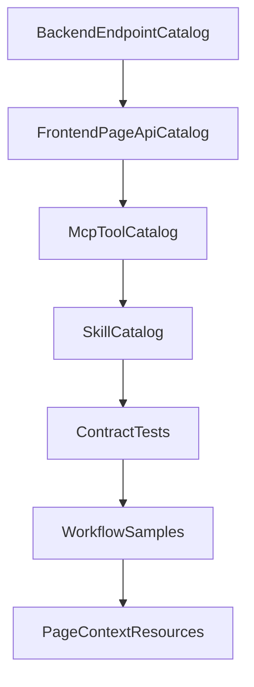

# DataEye Workflow And Resource Roadmap

> 目的：把“持续学习 DataEye 并变聪明”拆成可验证、可迭代的工程路线。

## 1. 推荐落地顺序

## 2. Catalog 生成与维护

### 后端 Endpoint Catalog

建议扫描范围：

- `dataeye/server/src/main/java/com/funsdata/server/tenant/controller/`
- `dataeye/server/src/main/java/com/funsdata/server/openapi/`
- `dataeye/core/src/main/java/com/funsdata/core/model/`

每个 endpoint 记录：

- `domain`：用户、角色、项目、产品、事件、分析、数据表、可视化等。
- `method/path`：HTTP 方法和路径。
- `requestModel/responseModel`：DTO/Param/VO。
- `mutation`：是否写操作。
- `permissionContext`：是否依赖 orgId、projectId、productId、token。
- `businessRules`：长度、唯一性、权限、状态流转等约束。
- `mcpCandidate`：atomic、business、resource、skip。

### 前端 Page/API Catalog

建议扫描范围：

- `dataeye-frontend/src/app/pages/MainPage/pages/`
- `dataeye-frontend/src/app/pages/MainPage/Layout/`
- `dataeye-frontend/src/app/pages/BiCLIWorkbench/`
- `dataeye-frontend/src/utils/request.tsx`

每个页面记录：

- `route/menuCode`：页面路由或菜单 code。
- `apiCalls`：调用的 `request2`、`instanceApi`、`callTool`。
- `stateContext`：项目、产品、组织、筛选条件、表单状态来源。
- `workflowHints`：多步表单、确认弹窗、上传预览、导出任务等。
- `skillCandidate`：是否需要新增或更新 Skill。

### MCP Tool Catalog

来源：

- `packages/mcp-server/src/tools/tool-domain-registry.ts`

每个工具记录：

- `name/domain/tier`。
- `inputSchema`。
- `handler`。
- `readOrWrite`。
- `dryRun`。
- `requiredContext`。
- `usedBySkills`。

### Skill Catalog

来源：

- `packages/skills/definitions/**/SKILL.md`

每个 Skill 记录：

- `name/triggers/requiredTools`。
- `runtimeAdmission`：是否会被 `/chat` 注入。
- `businessDomain`。
- `workflowCompleteness`：是否包含信息收集、dryRun、确认、验证、错误处理。
- `gaps`：缺工具、工具过细、无确认、无验证等。

## 3. 契约测试清单

已落地的第一批契约：

- `packages/mcp-server/src/tools/__tests__/skill-tool-contract.test.ts`
  - DataEye Skill 的 `requiredTools` 必须存在于 MCP registry。
  - 写向 business action 必须暴露 `dryRun`，描述中体现确认或预览。

建议继续增加：

- MCP `ListTools` 名称集合与 `loadChatToolRegistry` 名称集合完全一致。
- `tier=business` 工具必须声明 `domain` 和完整 `inputSchema`。
- Skill runtime admission 覆盖所有高优先级 workflow Skill。
- `message_block`、`chart_data`、`follow_ups` SSE 事件字段稳定。
- 前端 `useChatStream.ts` 事件类型与后端 `stream.ts` 输出契约一致。

## 4. 首批工作流样板

### 用户与角色

目标：用户说“创建用户并分配角色”时，一次完成检查、预览、创建、验证。

标准流程：

1. 缺角色时调用 `dataeye_role_list`。
2. 调用 `dataeye_user_onboard(dryRun=true)`。
3. 用户确认后调用 `dataeye_user_onboard(dryRun=false)`。
4. 根据 `verified` 和 `roleVerified` 输出结果。

后续扩展：

- `dataeye_role_onboard`：创建角色并绑定项目/产品权限。
- `dataeye_permission_diagnose`：解释用户看不到项目/产品/菜单的原因。

### 数据表管理

目标：用户给样例数据或文件预览后，自动推断字段并创建表。

标准流程：

1. 缺项目时调用 `dataeye_project_list`。
2. 调用 `dataeye_table_import_create(dryRun=true)`。
3. 用户确认字段、表名、表类型。
4. 调用 `dataeye_table_import_create(dryRun=false)`。
5. 如 `dataImportStatus=not_supported`，明确说明只建表未导入数据。

后续扩展：

- 接入真实文件内容读取或上传后，升级 `fileId` 从预留字段为可执行输入。
- 增加字段质量检查：主键建议、时间字段建议、字段名规范化。

### 自助分析

目标：保存分析只传 ID 时，仍能从后端记录恢复完整查询参数并执行。

标准流程：

1. `dataeye_analysis_list` 找到保存分析。
2. `dataeye_analysis_execute` 读取保存分析记录并合并 `prp`、时间、产品、粒度、timezone。
3. 按分析类型选择事件、漏斗、留存 endpoint。
4. 返回图表数据块和摘要，不重复输出原始大表。

后续扩展：

- 增加 `dataeye_analysis_compare`：多分析结果对比。
- 增加 `dataeye_analysis_explain_params`：解释保存分析的筛选条件、指标和维度。

## 5. 页面上下文与 MCP Resource 规划

当前 `collectPageContext.ts` 偏 DOM 采样，后续建议拆成页面 adapter：

| 页面类型 | Resource | 内容 |
| --- | --- | --- |
| 分析页 | `currentAnalysisDraft` | 分析类型、时间范围、产品、事件、维度、指标、筛选 |
| 数据表页 | `currentTableSchema` | 表名、字段、类型、状态、所属项目 |
| 事件页 | `currentEventSchema` | 事件名、属性、状态、所属产品 |
| 用户/角色页 | `currentAccessContext` | 组织、用户、角色、权限范围 |
| 看板页 | `currentDashboardContext` | 看板 ID、图表列表、筛选器、可执行图表 |

后端接收策略：

- 小上下文直接进入 prompt。
- 大上下文只进摘要和 resource id。
- 工具执行时按 resource id 二次读取真实数据，避免 prompt 膨胀。

## 6. 后续工程拆分

建议后续按三个 PR/阶段推进：

1. `catalog-foundation`：自动 catalog 生成器与文档输出。
2. `contract-governance`：Skill/MCP/前后端协议契约测试。
3. `workflow-expansion`：按业务域扩展 business action、Skill、page resource。

每个阶段都应保持测试可运行、文档可审查、工具可回滚。
