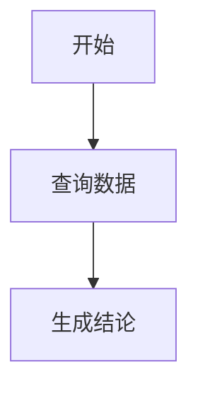

# Chat Rich Content Rendering Implementation Plan

> **For agentic workers:** REQUIRED: Use superpowers:subagent-driven-development (if subagents available) or superpowers:executing-plans to implement this plan. Steps use checkbox (`- [ ]`) syntax for tracking.

**Goal:** Build a robust BiCLI chat rendering layer that formally supports common Markdown, code languages, Mermaid diagrams, and extensible structured message blocks while falling back safely for uncommon content.

**Architecture:** Move Markdown rendering out of `MessageItem.tsx` into focused renderer components. Use a central language registry for syntax highlighting, a dedicated Mermaid renderer for diagram code blocks, and a block registry for structured `message_block` UI. Failures are isolated to the smallest content unit.

**Tech Stack:** React 17, TypeScript, styled-components, react-markdown, remark-gfm, rehype-highlight, highlight.js, Mermaid, existing BiCLI SSE `message_block` protocol.

---

对应设计：`docs/2026-04-28-chat-rich-content-rendering-design.md`

## File Structure

Create:

- `dataeye-frontend/src/app/pages/BiCLIWorkbench/Chat/Markdown/ChatMarkdownRenderer.tsx`
- `dataeye-frontend/src/app/pages/BiCLIWorkbench/Chat/Markdown/MarkdownCodeBlock.tsx`
- `dataeye-frontend/src/app/pages/BiCLIWorkbench/Chat/Markdown/MermaidBlock.tsx`
- `dataeye-frontend/src/app/pages/BiCLIWorkbench/Chat/Markdown/markdownLanguages.ts`
- `dataeye-frontend/src/app/pages/BiCLIWorkbench/Chat/Markdown/markdownSecurity.ts`
- `dataeye-frontend/src/app/pages/BiCLIWorkbench/Chat/Blocks/blockRegistry.tsx`
- `dataeye-frontend/src/app/pages/BiCLIWorkbench/Chat/Blocks/UnknownBlock.tsx`
- `dataeye-frontend/src/app/pages/BiCLIWorkbench/Chat/Blocks/StepsBlock.tsx`
- `dataeye-frontend/src/app/pages/BiCLIWorkbench/Chat/__tests__/ChatMarkdownRenderer.test.tsx`
- `dataeye-frontend/src/app/pages/BiCLIWorkbench/Chat/__tests__/markdownLanguages.test.ts`
- `dataeye-frontend/src/app/pages/BiCLIWorkbench/Chat/__tests__/MessageBlocks.test.tsx`

Move or refactor:

- `dataeye-frontend/src/app/pages/BiCLIWorkbench/Chat/MessageBlocks.tsx` to use `Blocks/blockRegistry.tsx`.
- `dataeye-frontend/src/app/pages/BiCLIWorkbench/Chat/TableBlock.tsx` can stay in place for P0, or move to `Blocks/TableBlock.tsx` if imports are updated together.

Modify:

- `dataeye-frontend/src/app/pages/BiCLIWorkbench/Chat/MessageItem.tsx`
- `dataeye-frontend/src/app/pages/BiCLIWorkbench/hooks/useChatStream.ts`
- `bicli/packages/mcp-server/src/chat/message-blocks.ts`
- `bicli/packages/mcp-server/src/chat/system-prompt.ts`
- `dataeye-frontend/package.json`

## Chunk 1: Markdown Renderer Boundary

### Task 1: Extract `ChatMarkdownRenderer`

**Files:**

- Create: `dataeye-frontend/src/app/pages/BiCLIWorkbench/Chat/Markdown/ChatMarkdownRenderer.tsx`
- Modify: `dataeye-frontend/src/app/pages/BiCLIWorkbench/Chat/MessageItem.tsx`
- Test: `dataeye-frontend/src/app/pages/BiCLIWorkbench/Chat/__tests__/ChatMarkdownRenderer.test.tsx`

- [ ] **Step 1: Write a failing render test**

Test that assistant Markdown with GFM table and task list renders through `ChatMarkdownRenderer`.

```tsx
render(
  <ChatMarkdownRenderer
    content={'- [x] done\n\n| a | b |\n| - | - |\n| 1 | 2 |'}
  />,
);
expect(screen.getByRole('table')).toBeInTheDocument();
expect(screen.getByText('done')).toBeInTheDocument();
```

- [ ] **Step 2: Run the failing test**

Run:

```bash
npm run test -- ChatMarkdownRenderer.test.tsx --watchAll=false --runInBand
```

Expected: fail because `ChatMarkdownRenderer` does not exist.

- [ ] **Step 3: Implement `ChatMarkdownRenderer`**

Implementation requirements:

- Use `ReactMarkdown`.
- Use `remarkGfm`.
- Do not enable raw HTML.
- Accept `content: string`.
- Accept optional `className`.
- Keep current Markdown styles either inside this component or by wrapping it with existing `MarkdownBox` styles.

- [ ] **Step 4: Replace direct Markdown usage in `MessageItem.tsx`**

`MessageItem.tsx` should no longer import:

- `ReactMarkdown`
- `remark-gfm`
- `rehype-highlight`
- highlight.js language modules

It should render:

```tsx
<MarkdownBox>
  <ChatMarkdownRenderer content={msg.content || ''} />
</MarkdownBox>
```

- [ ] **Step 5: Run focused checks**

Run:

```bash
npm run eslint -- src/app/pages/BiCLIWorkbench/Chat/MessageItem.tsx src/app/pages/BiCLIWorkbench/Chat/Markdown/ChatMarkdownRenderer.tsx
```

Expected: exit 0.

## Chunk 2: Code Language Registry

### Task 2: Centralize supported code languages

**Files:**

- Create: `dataeye-frontend/src/app/pages/BiCLIWorkbench/Chat/Markdown/markdownLanguages.ts`
- Create: `dataeye-frontend/src/app/pages/BiCLIWorkbench/Chat/Markdown/MarkdownCodeBlock.tsx`
- Modify: `dataeye-frontend/src/app/pages/BiCLIWorkbench/Chat/Markdown/ChatMarkdownRenderer.tsx`
- Test: `dataeye-frontend/src/app/pages/BiCLIWorkbench/Chat/__tests__/markdownLanguages.test.ts`

- [ ] **Step 1: Write language registry tests**

Cover:

- `gradle` resolves to `groovy`.
- `gradle.kts` resolves to `kotlin`.
- `yml` resolves to `yaml`.
- unknown language returns unsupported status but preserves original label.

- [ ] **Step 2: Implement `markdownLanguages.ts`**

Export:

```ts
export interface MarkdownLanguageConfig {
  canonical: string;
  aliases: string[];
  label: string;
}

export function resolveMarkdownLanguage(language?: string): {
  canonical?: string;
  label?: string;
  supported: boolean;
};

export const rehypeHighlightOptions: {
  languages: Record<string, unknown>;
  aliases: Record<string, string[]>;
};
```

P0 language groups:

- Web: JavaScript, TypeScript, JSX, TSX, HTML, CSS, SCSS, Less.
- Data: JSON, YAML, XML, CSV.
- Shell: Bash, Shell, SH, ZSH, PowerShell.
- Backend: Java, Kotlin, Groovy, Gradle, Python, Go, Rust, PHP, Ruby, C, C++, C#.
- Database: SQL, MySQL, PostgreSQL.
- Ops/config: Dockerfile, properties, ini, toml, nginx, log.
- Docs: Markdown, text, plaintext.

- [ ] **Step 3: Implement `MarkdownCodeBlock`**

Requirements:

- Detect language from `className` like `language-gradle`.
- Render language label in the code block header.
- Use supported language highlighting through `rehype-highlight`.
- Unknown language renders ordinary code with header “未增强高亮：<language>”.
- Add copy button for block source.
- Long code blocks have max height and scroll.

- [ ] **Step 4: Wire custom code component**

`ChatMarkdownRenderer` should override Markdown `code` rendering:

- Inline code uses normal `<code>`.
- Fenced code block uses `MarkdownCodeBlock`.
- `language-mermaid` is reserved for `MermaidBlock` in Chunk 3.

- [ ] **Step 5: Run focused checks**

Run:

```bash
npm run test -- markdownLanguages.test.ts --watchAll=false --runInBand
npm run eslint -- src/app/pages/BiCLIWorkbench/Chat/Markdown
```

Expected: tests pass and ESLint exits 0.

## Chunk 3: Mermaid Diagram Rendering

### Task 3: Add Mermaid renderer for diagram code blocks

**Files:**

- Create: `dataeye-frontend/src/app/pages/BiCLIWorkbench/Chat/Markdown/MermaidBlock.tsx`
- Modify: `dataeye-frontend/src/app/pages/BiCLIWorkbench/Chat/Markdown/ChatMarkdownRenderer.tsx`
- Modify: `dataeye-frontend/package.json`
- Test: `dataeye-frontend/src/app/pages/BiCLIWorkbench/Chat/__tests__/ChatMarkdownRenderer.test.tsx`

- [ ] **Step 1: Add dependency**

Run:

```bash
npm install mermaid
```

Do not hand-edit package versions.

- [ ] **Step 2: Write Mermaid render tests**

Because Mermaid uses browser APIs and async SVG rendering, mock the `mermaid` module.

Test cases:

- `language-mermaid` routes to `MermaidBlock`.
- Successful render inserts SVG container.
- Render failure shows source code and error message.
- Theme changes re-initialize or re-render Mermaid with the matching light/dark theme.
- Click on rendered diagram opens zoom/fullscreen preview.

- [ ] **Step 3: Implement `MermaidBlock`**

Requirements:

- Initialize Mermaid once with:

```ts
mermaid.initialize({
  startOnLoad: false,
  securityLevel: 'strict',
  logLevel: 'error',
});
```

- Generate unique diagram ID per render.
- Call `mermaid.render(id, source)`.
- Insert returned SVG into current container.
- Call `bindFunctions?.(container)`.
- Catch parse/render errors locally.
- Show fallback UI with source and copy button.
- Follow the current system/application theme: light mode uses Mermaid default theme, dark mode uses Mermaid dark/base theme.
- Support click-to-zoom or fullscreen preview for large diagrams.

- [ ] **Step 4: Support common diagram types**

Supported through Mermaid:

- `flowchart` / `graph`
- `sequenceDiagram`
- `classDiagram`
- `stateDiagram` / `stateDiagram-v2`
- `erDiagram`
- `gantt`
- `pie`
- `journey`
- `timeline`
- `mindmap`

No separate parser is needed in P0; Mermaid determines validity.

- [ ] **Step 5: Run focused checks**

Run:

```bash
npm run test -- ChatMarkdownRenderer.test.tsx --watchAll=false --runInBand
npm run eslint -- src/app/pages/BiCLIWorkbench/Chat/Markdown
```

Expected: tests pass and ESLint exits 0.

## Chunk 4: Block Registry and Unknown Fallback

### Task 4: Make structured blocks extensible

**Files:**

- Create: `dataeye-frontend/src/app/pages/BiCLIWorkbench/Chat/Blocks/blockRegistry.tsx`
- Create: `dataeye-frontend/src/app/pages/BiCLIWorkbench/Chat/Blocks/UnknownBlock.tsx`
- Create: `dataeye-frontend/src/app/pages/BiCLIWorkbench/Chat/Blocks/StepsBlock.tsx`
- Modify: `dataeye-frontend/src/app/pages/BiCLIWorkbench/Chat/MessageBlocks.tsx`
- Modify: `dataeye-frontend/src/app/pages/BiCLIWorkbench/hooks/useChatStream.ts`
- Test: `dataeye-frontend/src/app/pages/BiCLIWorkbench/Chat/__tests__/MessageBlocks.test.tsx`

- [ ] **Step 1: Write block fallback tests**

Cover:

- `table` still renders `TableBlock`.
- unknown type renders `UnknownBlock`.
- malformed payload does not throw.

- [ ] **Step 2: Implement `UnknownBlock`**

Requirements:

- Shows “暂不支持的消息块：<type>”.
- Displays block title if present.
- Does not dump full payload by default.
- Optional details toggle can show sanitized JSON preview with size limit.

- [ ] **Step 3: Implement `blockRegistry.tsx`**

Export:

```ts
export const blockRegistry = {
  table: TableBlock,
  steps: StepsBlock,
};

export function getBlockRenderer(type: string): React.ComponentType<any>;
```

- [ ] **Step 4: Implement `StepsBlock`**

Payload:

```ts
interface StepsBlockPayload {
  steps: Array<{
    title: string;
    description?: string;
    status?: 'wait' | 'process' | 'finish' | 'error';
  }>;
  orientation?: 'vertical' | 'horizontal';
}
```

Use Ant Design `Steps` if available and lightweight enough; otherwise implement a simple styled vertical list.

- [ ] **Step 5: Update frontend block types**

In `useChatStream.ts`, add:

- `StepsBlockPayload`
- `StepsMessageBlock`
- Known union type for `TableMessageBlock | StepsMessageBlock | MessageBlock`

Unknown block must still be accepted.

- [ ] **Step 6: Run focused checks**

Run:

```bash
npm run test -- MessageBlocks.test.tsx --watchAll=false --runInBand
npm run eslint -- src/app/pages/BiCLIWorkbench/Chat/Blocks src/app/pages/BiCLIWorkbench/Chat/MessageBlocks.tsx
```

Expected: tests pass and ESLint exits 0.

## Chunk 5: Backend Protocol Alignment

### Task 5: Extend backend block types and model guidance

**Files:**

- Modify: `bicli/packages/mcp-server/src/chat/message-blocks.ts`
- Modify: `bicli/packages/mcp-server/src/chat/system-prompt.ts`
- Test: `bicli/packages/mcp-server/src/chat/__tests__/message-blocks.test.ts`

- [ ] **Step 1: Write backend block validation tests**

Cover:

- `steps` block passes extraction.
- unknown block type is either filtered or marked safe according to current protocol choice.
- malformed block with missing id/payload is filtered.

- [ ] **Step 2: Extend `MessageBlockType`**

Add:

- `steps`
- `timeline`
- `diagram`
- `callout`

Keep existing types.

- [ ] **Step 3: Add `StepsBlockPayload` type**

Mirror frontend payload shape.

- [ ] **Step 4: Update extraction validation**

`extractMessageBlocksFromToolResult` should:

- Accept only safe block objects.
- Preserve unknown-but-structurally-valid types only if frontend is expected to show `UnknownBlock`.
- Filter missing `id`, missing `type`, or missing `payload`.

- [ ] **Step 5: Update system prompt display rules**

Add guidance:

- Use Mermaid code blocks for explanatory diagrams.
- Use structured blocks for tool-result data.
- Do not recreate large tool results as Markdown tables.
- Keep Mermaid diagrams concise.

- [ ] **Step 6: Run backend checks**

Run:

```bash
pnpm --filter @bicli/mcp-server test -- src/chat/__tests__/message-blocks.test.ts
pnpm --filter @bicli/mcp-server build
```

Expected: tests pass and build exits 0. If the local Node version warning appears but exit code is 0, record it as non-blocking.

## Chunk 6: Verification Scenarios

### Task 6: Verify end-to-end rendering behavior

**Files:**

- Modify only if bugs are found in previous chunks.

- [ ] **Step 1: Prepare manual samples**

Use one assistant message containing:

````markdown
```gradle
plugins {
  id 'java'
}
```

```gradle.kts
plugins {
  kotlin("jvm") version "1.9.0"
}
```

```unknownlang
hello world
```


````

- [ ] **Step 2: Verify expected UI**

Expected:

- Gradle Groovy DSL code block renders with language label.
- Gradle Kotlin DSL code block renders with language label.
- Unknown language code block renders source and label, without crash.
- Mermaid flowchart renders SVG.
- Mermaid theme follows the current system/application theme.
- Clicking the Mermaid diagram opens a larger preview.
- Broken Mermaid source shows local fallback, without crashing the message.

- [ ] **Step 3: Verify existing table block**

Trigger or mock a `message_block(type="table")`.

Expected:

- Existing `TableBlock` remains visible.
- Copy button still works.
- Sensitive tag behavior remains unchanged.

- [ ] **Step 4: Verify unknown block fallback**

Mock:

```json
{
  "id": "block_unknown_1",
  "type": "future_widget",
  "title": "未来组件",
  "payload": { "demo": true }
}
```

Expected:

- UI shows `UnknownBlock`.
- No React error overlay.

- [ ] **Step 5: Run final checks**

Run:

```bash
npm run eslint -- src/app/pages/BiCLIWorkbench/Chat src/app/pages/BiCLIWorkbench/hooks/useChatStream.ts
pnpm --filter @bicli/mcp-server test -- src/chat/__tests__/message-blocks.test.ts
```

Optional if environment supports it:

```bash
npm run checkTs -- --pretty false
pnpm --filter @bicli/mcp-server build
```

Record any environment-only failures separately, especially existing dependency `.d.ts` compatibility errors.

## Follow-up Work

P1:

- Add `ChartBlock` and migrate new chart events to `message_block(type="chart")` while preserving `chart_data` as a long-term compatibility adapter for old sessions and older backends.
- Add `MetricCardsBlock`.
- Add `CalloutBlock`.
- Persist blocks in historical messages using the best-practice two-layer strategy:
  - Store lightweight block metadata, ordering, summary, version, and payload references in message metadata.
  - Store large payloads such as table rows and chart series in dedicated message block storage or object references.
  - Load large payloads lazily when reopening sessions, with an expired/unavailable fallback state.

P2:

- Add `TimelineBlock`, `DiagramBlock`, `FormRequestBlock`, `ConfirmationBlock`.
- Support more chart types: `pie`, `area`, `stacked_bar`, `scatter`, `combo`.
- Add render telemetry for unsupported language, Mermaid error, and unknown block type.

## Implementation Notes

- Do not use `ignoreMissing: true` as the primary solution for common languages. Register common languages and aliases explicitly.
- Unknown languages must still be readable as plain code blocks.
- Do not allow raw HTML in Markdown.
- Mermaid is for explanatory diagrams. Business data charts should use structured `message_block`.
- Mermaid must follow the system/application theme and support click-to-zoom.
- Keep `chart_data` compatibility; do not remove legacy rendering until all persisted sessions and backend producers have migrated.
- Avoid large refactors outside `BiCLIWorkbench/Chat` unless required by type sharing.

## Completion Criteria

- Design document exists at `docs/2026-04-28-chat-rich-content-rendering-design.md`.
- This plan exists at `docs/superpowers/plans/2026-04-28-chat-rich-content-rendering.md`.
- P0 implementation can load historical messages containing `gradle`, `gradle.kts`, unknown code language, and Mermaid diagrams.
- Existing table block behavior is preserved.
- Unsupported content has visible fallback instead of breaking session loading.
