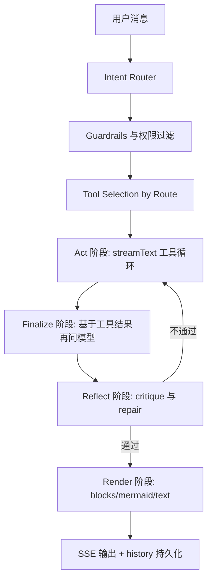

# BiCLI Agent Runtime Loop 设计

> **Status:** Draft for implementation planning
> **Date:** 2026-04-30
> **Scope:** `packages/mcp-server/src/chat/*`、`packages/mcp-server/src/tools/*`、`packages/skills/definitions/*`、`packages/mcp-server/src/chat/system-prompt.ts`

## 1. 背景

BiCLI 现在的对话链路核心在 `packages/mcp-server/src/chat/stream.ts`：单次调用 `streamText`，把所有工具一次性塞给模型，工具结果流式回灌之后，依赖模型继续输出最终答复。多次问题暴露出来：

- 知识型问题（流程、区别、最佳实践、SDK 接入）经常被强制触发工具，结果调到没有权限的 `data_query/config_get`，对话被拦住。
- 让模型查工具时，模型有时只调一个工具就停止，或者干脆从历史上下文“幻读”，不再调用工具。
- 调了工具但模型空输出，前端就显示“模型未返回任何内容”，工具结果没有被复用。
- 流程、状态流转、生命周期类的回答，缺少图形和结构化展示。

这些问题不是“多写两条提示词”就能解决的。Claude Code、OpenAI Agents SDK、LangGraph reflection agent 等成熟实现都把这些职责放在 runtime 层，而不是模型 prompt 层。我们也需要把 BiCLI 的对话流程从“一次模型调用”升级为显式的 **Agent Runtime Loop**。

## 2. 现状

### 2.1 对话主循环

`handleChatStream`（`packages/mcp-server/src/chat/stream.ts`）做的事：

1. 把 history + user message 送进 `streamText`。
2. 一次调用里允许最多 `maxSteps` 步工具。
3. 流式接收 `text-delta`、`tool-call`、`tool-result`、`error`。
4. 流结束后做几件事：
   - 检测 fake `tool_code`、`<function_calls>` 等假工具调用文本。
   - 用 `shouldRequireToolCall(userMessage)` 判断是否“必须调工具但模型没调”，触发 `runRepairRound`。
   - 用列表项数量启发式检测“疑似从历史幻读”，触发 `runRepairRound`。
   - 用 `buildToolResultFallback` 在工具调用后但模型空输出时给兜底摘要。
   - 用 `sanitizeEmptyAnalysisSpeculation` 拦截“空结果但下了根因结论”的回答。
5. `extractFollowUps` 提取末尾建议问题。

### 2.2 工具暴露

`tool-domain-registry.ts` 把所有启用的工具扁平化成一个数组，`buildSystemPrompt` 把工具列表全部塞进 system prompt。模型每次都要在几十个工具里挑。`tier`（`business`/`atomic`）目前只在描述里有提示，但在调用环节没有差异化暴露。

### 2.3 Skill 系统

`packages/skills/definitions/<skill>/SKILL.md` 用 YAML 头声明 `triggers` 和 `requiredTools`，正文是工作流。Skill 被路由匹配后注入 system prompt。但 Skill 命中后并没有改变工具集合，也不会把对话切到“知识模式”。

### 2.4 兜底链路

我们已经做了多个兜底：`shouldRequireToolCall`、`runRepairRound`、`hallucination 列表检测`、`sanitizeEmptyAnalysisSpeculation`、`buildToolResultFallback`、`sanitizeVisibleHistoryArtifacts`。问题是这些兜底散落在 stream 末尾，互相不感知，也没有统一的 `state machine`，更没有“工具结果之后再问一遍模型”的 finalizer 阶段。

## 3. 根因

按 Claude Code 文档的术语，一个 agent loop 是 “Receive prompt -> evaluate -> tool calls -> tool results -> repeat -> final text-only answer”。OpenAI Agents SDK 的 `Runner` 也是这个循环，只在“没有 tool calls 的纯文本输出”时才认定为 final output。LangGraph 的 reflection agent 进一步把 loop 拆成 `main -> critique -> revise` 子图。

我们的现状本质问题：

1. **没有显式 router**：意图判断只有正则，知识型 vs 实时数据 vs 写操作 vs 诊断没有结构化分层，所以容易误触发工具或漏调工具。
2. **工具集合是平铺的**：模型一次性看到所有工具描述，没有按意图裁剪，容易选错工具。
3. **没有 finalizer 阶段**：工具结果回灌后，依赖同一轮模型继续输出。如果它被截断、空输出、被安全策略中止，工具结果就废掉了。
4. **修复策略零散**：`runRepairRound`、空输出兜底、幻读检测各做各的。没有“critique 这一答复是否引用了工具结果、是否未验证下结论、是否漏调用工具”这种统一审视。
5. **知识没有工具化**：流程、概念、最佳实践依赖模型记忆，所以要么误调实时工具，要么从历史上下文幻读。

## 4. 最佳实践目标

参考 Claude Code Agent SDK、OpenAI Agents SDK、LangGraph reflection agent 的共同模式，把 BiCLI 的对话拆成显式阶段：

1. **Plan / Route**：识别意图，决定可用工具集合、是否需要知识、是否需要用户确认。
2. **Act**：模型在受限工具集合上做 function calling，执行工具，回灌结果。
3. **Observe / Finalize**：以工具结果为唯一证据，再次调用模型生成最终答复。
4. **Reflect / Repair**：对最终答复做规则 + 模型双层校验，必要时重跑 act 或 finalize。
5. **Render**：根据结果形态选择 Mermaid、message blocks、文字摘要的组合。

每个阶段都有明确输入输出和上限，不靠 system prompt 兜全部规则。

## 5. 目标与非目标

### 5.1 目标

- 知识型/流程型问题不会被强制触发实时工具。
- 实时查询、写操作、诊断类问题必须经过工具，工具结果一定会被复用。
- 工具调用之后必有 finalizer 阶段，避免“工具调成功但前端只显示警告”。
- 知识来源工具化，不再依赖模型记忆或历史上下文幻读。
- 流程、生命周期、对比类回答有统一的图形/结构化展示策略。
- 修复策略集中在 reflection 阶段，可观察、可关闭、可调参。

### 5.2 非目标

- 不切换底层模型 SDK，仍使用 `ai` 包 `streamText`。
- 不重写 Skill 文件结构，只在 runtime 层加路由。
- 不引入 LangGraph 这类外部状态机依赖；用 TypeScript 显式状态机即可。
- 不改 MCP 协议或前端 SSE 协议（仅扩展 `_meta` 字段）。
- 不强制所有问题都跑多模型反思（成本控制）。

## 6. 总体架构



每个阶段都有明确状态对象 `AgentRunState`：包含 `route`、`allowedTools`、`messages`、`toolCalls`、`finalText`、`reflectVerdict`、`renderHints`、`telemetry`。

## 7. 阶段详细设计

### 7.1 Intent Router

输入：用户消息、近期历史摘要、page context、当前 skill 命中结果。

输出：

```ts
interface RouteDecision {
  route:
    | "knowledge"        // 概念、流程、区别、最佳实践
    | "realtime_query"   // 列表、详情、当前数据
    | "write_action"     // 创建、修改、删除、启停
    | "diagnosis"        // 为什么没数据、为什么失败
    | "visual_explain";  // 状态机、生命周期、调用时序
  confidence: number;
  domains: string[];        // ["schedule", "user", "dashboard", ...]
  needsKnowledge: boolean;
  needsUserConfirm: boolean; // write_action 自动 true
  reasoning: string;
}
```

实现策略：

- 第一层：规则（覆盖高置信场景，避免每条消息都过模型）。
- 第二层：必要时调用一个轻量模型（可复用主模型，但参数 `temperature=0`、`maxTokens=200`）做 JSON 输出。
- 第三层：fallback 到 `realtime_query` 或 `knowledge`，给出降级策略。

知识型关键词不再仅是“是什么/概念/原理”，扩展到“流程、步骤、区别、对比、生命周期、最佳实践、接入、配置教程”。但只要消息里出现具体 ID、`当前/这个/上面/页面`，应优先走 `realtime_query` 或 `diagnosis`。

### 7.2 Tool Selection by Route

不再把所有工具暴露给模型，根据 `route + domains` 做白名单：

| Route             | 默认允许                                                                                                                     | 默认禁用                                                                  |
| ----------------- | ---------------------------------------------------------------------------------------------------------------------------- | ------------------------------------------------------------------------- |
| knowledge         | `dataeye_knowledge_search`、Skill reference 检索、`self_permissions`                                                          | 所有 `*_create/update/delete/execute`、所有 `data_query/config_*`         |
| realtime_query    | 对应 domain 的列表/详情类工具，例如 schedule/dashboard/user/event                                                              | 写工具、危险工具                                                          |
| write_action      | 对应 domain 的 business-tier 工具（带 dryRun），需要时附带 list/detail                                                         | 危险删除工具默认 dryRun，未确认前禁止 `delete=true`                       |
| diagnosis         | 日志、详情、状态、错误诊断工具                                                                                                | 写工具                                                                    |
| visual_explain    | knowledge 检索 + 极少量列表类工具（仅在用户引用具体对象时）                                                                   | 所有写工具、`data_query/config_*`                                         |

通过 `requiredPermissions` 和现有 `tier` 字段过滤；新增 `routeHints?: Array<RouteName>` 让 ToolDef 自描述适用 route。

### 7.3 Act 阶段

继续用 `streamText` + 受限工具集合。差别：

- 注入更短的“专项 system prompt”：包含 route、domains、allowed tools 的 description（不再列全部工具）。
- 工具调用结果走原有 SSE：`tool_start`、`tool_result`、`message_block`。
- Act 阶段允许产出 `text-delta`，但默认期望模型在工具循环内**只做工具调用**，最终回答留给 finalize。这样减少“工具成功但模型自己空输出”导致内容缺失的概率。
- 提供 `maxToolTurns`（默认 6）和 `maxToolWallTime`（默认 30 秒）。

### 7.4 Finalize 阶段

无论 Act 阶段是否产出文本，只要本轮**有任何工具调用**或者 route 是 `knowledge`/`visual_explain`，就进入 finalize。

输入：

- 系统提示词（短版）：基于 route 的角色和约束。
- 用户原始消息。
- Act 阶段工具结果摘要（结构化提取关键字段，控制总长度，比如 ≤ 4000 字符）。
- 知识检索结果（如果 router 标记 `needsKnowledge`）。

要求模型只产出最终自然语言（外加可选 Mermaid 块、可选简短建议清单）。禁止再调用工具。

输出：

- 文本主体。
- `__followups__`、`__renderHints__`（可选，告诉前端用 callout / steps / mermaid 之外的展示）。

实现：用 `streamText` 但不传 `tools`，或 `toolChoice: "none"`。如果 finalize 也空输出，进入 reflection 的 deterministic fallback。

### 7.5 Reflect 阶段

在 finalize 之后做规则 + 选择性模型 critique。

规则层（始终运行）：

- 工具调用为 0 但 router 判定必须调用 → 重跑 Act。
- 工具结果为空且回答中出现“可能、原因包括、SDK 未上报”等未验证措辞 → 替换成 `本次执行返回 0 条数据 …` 文案（已有 `sanitizeEmptyAnalysisSpeculation`，迁移过来）。
- 答复内容里包含历史截断标记或 `<!--tool_*-->` 注释 → 清洗（已有 `sanitizeVisibleHistoryArtifacts`）。
- 答复里包含工具调用代码（`<tool_code>`、JSON function call） → 用 deterministic fallback。
- 工具全部失败但回答出现 `✅ 成功` → critique 拦截，重写为失败说明。

模型 critique（按 route 选择性触发，比如 `diagnosis` 和 `write_action` 默认开启，`knowledge` 默认关闭）：

输入：用户问题 + finalize 答复 + 工具结果摘要。
要求模型回答一个 JSON：

```json
{ "verdict": "ok" | "needs_repair", "reasons": [...], "suggestedRoute": "..." }
```

`needs_repair` 时调用 `runRepairRound`，最多 1 次。

### 7.6 Render

根据 route 和工具结果给出渲染建议：

- `visual_explain`：默认输出 “短文字 + Mermaid”。
- `knowledge`：默认输出 “步骤列表 + 引用来源”。
- `realtime_query`：复用现有 `result-block-factory` 输出 `metric_cards/chart/table/summary`。
- `diagnosis`：用 `summary + warning` 块。
- `write_action`：dryRun 阶段必须输出 `confirmation` block；执行后输出 `summary + table`。

提供一个统一的 `RenderHints` 字段写入 SSE `_meta`，前端可按 hint 优先选择渲染器。

### 7.7 知识工具

新增至少两个工具：

- `dataeye_knowledge_search(query, scope)`：在 Skill `reference/`、`docs/getting-started.md`、产品手册、FAQ 中检索相关章节，返回片段。
- `dataeye_concept_explain(topic)`：返回结构化“概念、范围、关键差异、典型操作”，覆盖高频概念（启动/立即执行、Cron 表达式、看板/视图/图表/定时任务关系、SDK 接入流程）。

实现：先用静态资料库（YAML/Markdown 索引）+ `lunr.js`/简单包含匹配。后续可以接入向量检索。这两个工具默认在 `knowledge`、`visual_explain` route 启用。

### 7.8 可观测性

`AgentRunState` 落到 trace 里，SSE 多发一个 `agent_trace` 事件给前端调试面板（可关闭），包含：route、allowedToolNames、toolCalls.length、finalize 是否运行、reflect verdict、repair 次数、耗时。日志里每一阶段打 `[agent] phase=router|act|finalize|reflect|render result=...`。

## 8. 数据模型

```ts
interface AgentRunState {
  sessionId: number;
  userMessage: string;
  pageContextEvidence?: unknown;
  route: RouteDecision;
  allowedTools: ToolDef[];
  messages: ChatMessage[];
  toolCalls: ToolCallRecord[];
  collectedBlocks: MessageBlock[];
  collectedCharts: unknown[];
  actText: string;
  finalText: string;
  reflectVerdict: "ok" | "needs_repair" | "fallback";
  renderHints: RenderHints;
  telemetry: {
    routerMs: number;
    actMs: number;
    finalizeMs: number;
    reflectMs: number;
    repairCount: number;
    toolDurations: Record<string, number>;
  };
}
```

`ToolDef` 扩展：

```ts
interface ToolDef {
  // ...existing
  routeHints?: Array<"knowledge" | "realtime_query" | "write_action" | "diagnosis" | "visual_explain">;
  knowledgeOnly?: boolean;
}
```

SSE 协议扩展（向后兼容）：

- 新增 `event: agent_trace`，payload 是 telemetry 的子集。
- 已有 `message_block` 增加可选 `payload.renderHint`。

## 9. 与现有代码的关系

| 现有                                 | 处理方式                                                     |
| ------------------------------------ | ------------------------------------------------------------ |
| `shouldRequireToolCall`              | 拆成 router 中的“需要调用实时工具”规则的子集，保持单测       |
| `runRepairRound`                     | 改名为 `runActRepair`，由 reflect 阶段统一调度                |
| `buildToolResultFallback`            | 进入 reflect deterministic fallback 分支                     |
| `sanitizeEmptyAnalysisSpeculation`   | 进入 reflect 规则层                                           |
| `sanitizeVisibleHistoryArtifacts`    | 进入 reflect 规则层                                           |
| `buildSystemPrompt`                  | 拆成 `buildBaseSystemPrompt` + `buildRouteSystemPrompt`      |
| `tool-domain-registry`               | 新增 `routeHints`，给现有工具补字段；`getEnabledTools` 增加 `byRoute()` 选择器 |
| `result-block-factory`               | 复用，增加 `routeHint` 参数                                  |

## 10. 风险与边界

- **延迟**：finalize 阶段要再调一次模型，长尾耗时增加。需要：finalize 输入裁剪、流式输出、route=knowledge 时如果没有工具结果可以跳过 finalize。
- **成本**：对话步数从 1 次扩展到最多 3 次（act + finalize + 可选 reflect）。提供 `AGENT_DISABLE_REFLECT`、`AGENT_DISABLE_FINALIZE` 环境开关，并在 trace 里记录开销。
- **路由错误**：router 误判会导致禁用必要工具或漏调工具。需要：router 输出 confidence；低置信走兜底（保留 act 阶段全部工具）；reflect 检测到漏调时自动 repair。
- **知识工具数据源**：初版只依赖仓库内 Markdown，覆盖面有限。需要建立后续维护机制。
- **写操作语义**：dryRun 流程必须和现有 `dataeye_user_onboard` / `dataeye_schedule_manage` 一致，不能在 router 层重复定义。
- **现有 Skill 兼容**：Skill 仍按 `requiredTools` 注入 system prompt，在 route 受限场景下需要兼容（route 与 skill 同时生效时取交集）。

## 11. 验收标准

1. 用户问“帮我看下接入 SDK 的流程”、“启动和立即执行的区别”、“最佳实践”等知识问题：
   - router 输出 `knowledge`。
   - 不调用 `data_query/config_get` 等业务工具。
   - finalize 阶段产出文字，必要时附 Mermaid。
2. 用户问“查一下定时任务列表”、“执行某看板”等实时问题：
   - router 输出 `realtime_query` 或 `write_action`。
   - act 阶段调用相应工具。
   - finalize 阶段一定有自然语言总结，不再出现“模型未返回任何内容”。
3. 用户问“为什么这个分析没数据”：
   - router 输出 `diagnosis`。
   - act 阶段调用诊断类工具。
   - reflect 阶段拦截“可能原因”等未验证根因，强制改写为基于事实的结论。
4. router 误判时 reflect 能至少修复一次，超过修复上限给出明确降级提示。
5. 写操作必须先 dryRun，未确认前不调用真实写工具。
6. SSE 中可见 `agent_trace`，包含 route、工具数量、阶段耗时。
7. 单测覆盖：router 决策、tool selection、finalize 空输出处理、reflect 规则、repair 流程。

## 12. 阶段化交付

P0：

- Router + ToolDef.routeHints + Act/Finalize 双阶段。
- Reflect 规则层（搬现有 sanitize/fallback）。
- 现有 stream guard 重构成 reflect。

P1：

- 模型 critique（按 route 触发）。
- 知识工具 + dataeye-knowledge skill。
- agent_trace SSE 与前端调试面板。

P2：

- 路由结果缓存与 telemetry 上报。
- 多 agent / sub-agent 拆分（schedule、analysis、user 等独立 Runner）。
- 向量检索升级 knowledge 工具。
